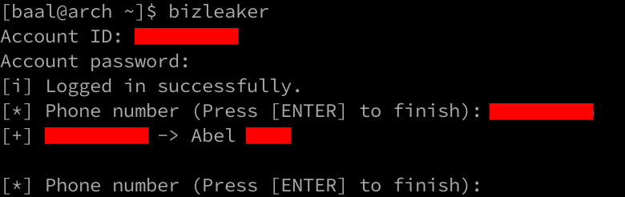

### Important Notice

This is not the full original version of the code. Sadly, to allegedly protect "Rights Of Use" of certain companies and to prevent misuse, I have been "persuaded" to censor parts of the code, and THIS code won't work. If you are willing to try the full version, contact me.

# Bizleaker - **CENSORED** Name Scraper

Bizleaker records name (usually name and the initials of the surnames) information from the **CENSORED** service automatically. The purpose of the tool is to check large amounts of telephone numbers quickly without graphical interface, to prevent scam, harassment, identity theft or to simply identify a friend before adding him as a contact. It is not intended for any criminal or wrongful use, but on the contrary, to prevent it.

Plenty of companies receive tons of petititons and messages through SMS, chat applications or phone calls through numbers they usually blindly trust because of the large volume of contacts they must attend to and the urgency of their tasks. In many cases, this ends up with many problems, messages that were intented to a different contact, confussions, information leaks, administrative errors or the worst of all (although not uncommon) money scams.

Bizleaker helps companies and individuals to check the identity of these numbers in a quick and easy way to prevent these types of problems. Bizleaker does not access in any illegal way to this information or to any service.



## Before using it...

You will also need to install a Web Driver, be it Firefox or Chrome. If you need help to install the latter, click [here](https://github.com/alejandrocora/install_webdriver "Install Webdriver").

## Installation

`$ git clone https://github.com/alejandrocora/bizleaker`  
`$ cd bizleaker`  
`$ pip3 install .`

## Help

Run `bizleaker --help` for help:
```
usage: app.py [-h] [--firefox] [--chrome] [--id ID] [--password PASSWORD] [--input INPUT] [--output OUTPUT] phones [phones ...]

positional arguments:
  phones               Phone numbers.

options:
  -h, --help           show this help message and exit
  --firefox            Use Firefox.
  --chrome             Use Chrome.
  --id ID              ID number for login.
  --password PASSWORD  Password for login.
  --input INPUT        Input file with the phone numbers list divided by lines.
  --output OUTPUT      Output file to store results.
```

### Disclaimer

Author is not responsible for its use or any type of error it may lead. Use it at your own risk.
